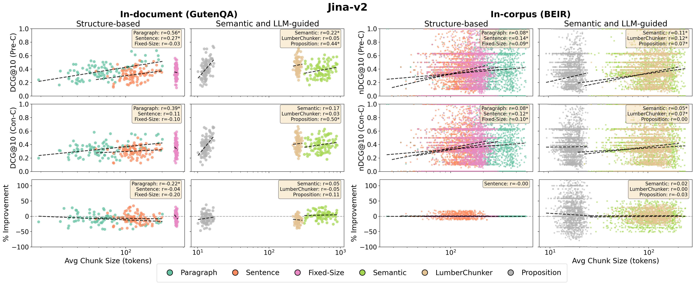
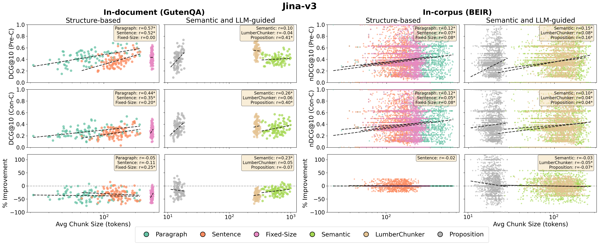
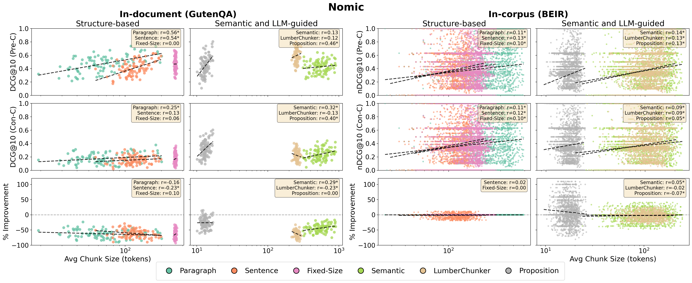
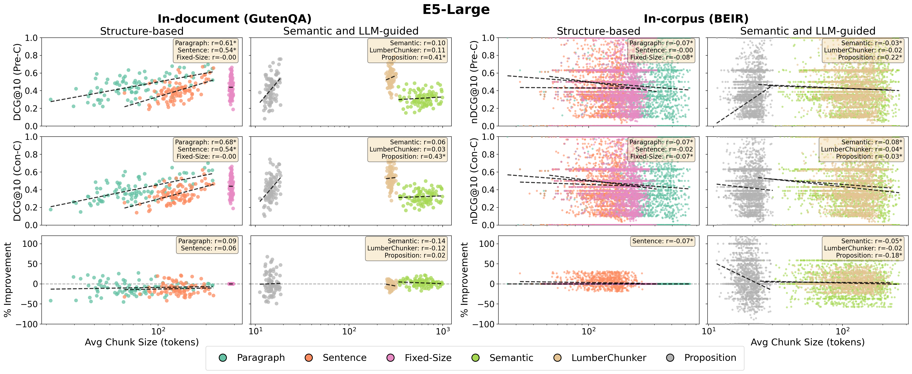

# Reproduce-chunking-2026

Reproducibility study of document chunking strategies for retrieval, as presented at ECIR 2026.

This repository provides a pipeline to **chunk**, **encode**, and **evaluate** documents using multiple chunking strategies and embedding models, reproducing and extending the results from the original paper.

## Table of Contents

- [Additional Results](#additional-results)
- [Datasets](#datasets)
- [Installation](#installation)
- [Project Overview](#project-overview)
- [Quick Start](#quick-start)
- [Module Details](#module-details)
  - [Chunker](#chunker)
  - [Encoder](#encoder)
  - [Evaluator](#evaluator)

---

## Additional Results

Results that could not fit in the paper due to page constraints are provided below.

### Table 2 (Extended): Pre-Chunking vs Contextualized Chunking (Jina-v3 and Nomic)

| Dataset   | Method     | Pre-C Orig (Jina-v3) | Pre-C Repro (Jina-v3) | Con-C Orig (Jina-v3) | Con-C Repro (Jina-v3) | Pre-C Orig (Nomic) | Pre-C Repro (Nomic) | Con-C Orig (Nomic) | Con-C Repro (Nomic) |
| ---       | ---        | ---                  | ---                   | ---                  | ---                   | ---                | ---                 | ---                | ---                 |
| SciFact   | Fixed-size | 0.718                | 0.717                 | 0.732                | 0.730                 | 0.707              | 0.703               | 0.706              | 0.707               |
|           | Sentence   | 0.714                | 0.716                 | 0.732                | 0.734                 | 0.713              | 0.715               | 0.714              | 0.712               |
|           | Semantic   | 0.712                | 0.710                 | 0.724                | 0.723                 | 0.704              | 0.704               | 0.705              | 0.705               |
| NFCorpus  | Fixed-size | 0.356                | 0.355                 | 0.367                | 0.368                 | 0.353              | 0.348               | 0.353              | 0.351               |
|           | Sentence   | 0.358                | 0.357                 | 0.366                | 0.367                 | 0.347              | 0.350               | 0.355              | 0.355               |
|           | Semantic   | 0.361                | 0.360                 | 0.366                | 0.367                 | 0.353              | 0.351               | 0.303              | 0.353               |
| FiQA      | Fixed-size | 0.333                | 0.468                 | 0.338                | 0.479                 | 0.370              | 0.386               | 0.383              | 0.387               |
|           | Sentence   | 0.304                | 0.433                 | 0.339                | 0.480                 | 0.351              | 0.362               | 0.377              | 0.380               |
|           | Semantic   | 0.303                | 0.440                 | 0.337                | 0.322                 | 0.348              | 0.356               | 0.369              | 0.266               |
| TRECCOVID | Fixed-size | 0.730                | 0.739                 | 0.772                | 0.766                 | 0.729              | 0.758               | 0.750              | 0.750               |
|           | Sentence   | 0.724                | 0.714                 | 0.765                | 0.769                 | 0.742              | 0.747               | 0.768              | 0.779               |
|           | Semantic   | 0.747                | 0.747                 | 0.762                | 0.699                 | 0.743              | 0.743               | 0.761              | 0.730               |

### RQ4: Impact of Chunk Size

Correlation between chunk size and retrieval performance for all four models:

<details>
<summary>Jina-v2 (jina-embeddings-v2-small-en)</summary>


</details>

<details>
<summary>Jina-v3 (jina-embeddings-v3)</summary>


</details>

<details>
<summary>Nomic (nomic-embed-text-v1)</summary>


</details>

<details>
<summary>E5-Large (multilingual-e5-large-instruct)</summary>


</details>

---

## Datasets

This project evaluates on two dataset groups:

- **Narrative (in-document retrieval):** [GutenQA_Paragraphs](https://huggingface.co/datasets/LumberChunker/GutenQA_Paragraphs)
- **BEIR (in-corpus retrieval):** [beir](https://github.com/beir-cellar/beir)
  - trec-covid, nfcorpus, fiqa, arguana, scidocs, scifact

### Download

1. Download the datasets and place them under `src/data/`.
2. For **GutenQA**, create a subfolder `src/data/GutenQA`.
3. For **BEIR**, unzip each dataset into `src/data/` (e.g. `src/data/nfcorpus/`).

---

## Installation

```bash
pip install -r requirements.txt
```

---

## Project Overview

The repository is organized into three core modules:

| Module        | Description                                                       |
| ---           | ---                                                               |
| **Chunker**   | Splits documents into chunks using various strategies             |
| **Encoder**   | Transforms chunks into embeddings (Regular or Late/Contextualized)|
| **Evaluator** | Computes ranking metrics (nDCG, DCG, Recall) for evaluation       |

### Supported Chunking Strategies

| Category         | Methods                                        |
| ---              | ---                                            |
| Structure-based  | ParagraphChunker, SentenceChunker, FixedSizeChunker |
| Semantic/LLM     | SemanticChunker, LumberChunker, Proposition    |

### Supported Embedding Models

| Model                              | Short Name |
| ---                                | ---        |
| jinaai/jina-embeddings-v2-small-en | Jina-v2    |
| jinaai/jina-embeddings-v3          | Jina-v3    |
| nomic-ai/nomic-embed-text-v1       | Nomic      |
| intfloat/multilingual-e5-large-instruct | E5-Large |

---

## Quick Start

Run all modules end-to-end using the provided shell scripts:

```bash
# Step 1: Chunk documents
nohup ./run_chunker.sh > run_chunker.log 2>&1 < /dev/null &

# Step 2: Encode chunks and queries
nohup ./run_encoder.sh > run_encoder.log 2>&1 < /dev/null &

# Step 3: Evaluate retrieval performance
nohup ./run_evaluator.sh > run_evaluator.log 2>&1 < /dev/null &
```

> **Note:** Each step depends on the outputs of the previous one. Before running the Encoder, update `QUERY_ID_BY_DATASET` in `run_encoder.sh` with the query IDs generated by the Chunker. Similarly, verify encoder run IDs before running the Evaluator.

---

## Module Details

### Chunker

Splits documents into smaller units for encoding and retrieval. Supports strategies from [LumberChunker](https://arxiv.org/abs/2406.17526) and [Late Chunking](https://arxiv.org/abs/2409.04701).

**Example:**

```bash
python -m src.runner chunker \
  --processor_name beir \
  --dataset_name nfcorpus \
  --data_folder src/data \
  --chunker ParagraphChunker \
  --output_folder src/outputs \
  --query
```

**Arguments:**

| Argument           | Description                                              |
| ---                | ---                                                      |
| `--processor_name` | Data processor (`GutenQA`, `beir`)                       |
| `--dataset_name`   | Dataset to process                                       |
| `--data_folder`    | Path to dataset folder                                   |
| `--chunker`        | Chunking strategy (e.g. `ParagraphChunker`, `SentenceChunker`) |
| `--output_folder`  | Output directory for chunks                              |
| `--query`          | Enable query mode (saves queries alongside chunks)       |
| `--sample`         | Optional: number of documents to sample                  |

---

### Encoder

Transforms text chunks into vector embeddings. Two encoding strategies are supported:

- **RegularEncoder**: Encodes each chunk independently.
- **LateEncoder**: Concatenates chunks from the same document, encodes jointly, then splits embeddings back (contextualized chunking).

**Example:**

```bash
python -m src.runner encoder \
  --encoder_name RegularEncoder \
  --dataset_name nfcorpus \
  --chunk_run_id SentenceChunker \
  --backbone JinaaiV2 \
  --model_name jinaai/jina-embeddings-v2-small-en \
  --batch_size 10 \
  --output_folder src/outputs \
  --query \
  --query_run_id 20250921-183217-beir-8f3497a6
```

**Arguments:**

| Argument              | Description                                              |
| ---                   | ---                                                      |
| `--encoder_name`      | Encoder class (`RegularEncoder`, `LateEncoder`)          |
| `--dataset_name`      | Dataset name                                             |
| `--chunk_run_id`      | ID of the chunking run to encode                         |
| `--backbone`          | Embedding backbone (e.g. `JinaaiV2`, `JinaaiV3`)        |
| `--model_name`        | HuggingFace model ID                                     |
| `--batch_size`        | Texts per batch                                          |
| `--output_folder`     | Output directory (default: `src/outputs`)                |
| `--query`             | Enable query encoding mode                               |
| `--query_run_id`      | ID of the query run to encode                            |

To add a custom encoder, create a class under `src/encoders/` inheriting from `BaseEncoder`. For custom embedding models, add a class under `src/models/embedding/` inheriting from `BaseEmbeddingModel`.

---

### Evaluator

Computes ranking-based metrics (nDCG, DCG, Recall) to benchmark chunking and encoding configurations.

**Example:**

```bash
python -m src.runner eval \
  --chunk_run_id 20250902-171846-ParagraphChunker-GutenQA-c78b6f37 \
  --query_run_id 20250902-171849-GutenQA-ed7846b6 \
  --chunk_embedding_run_id 20250902-175213-RegularEncoder-Qwen3-Qwen3-Embedding-0.6B-77072742 \
  --query_embedding_run_id 20250902-175652-RegularEncoder-Qwen3-13d17bce \
  --dataset_name GutenQA \
  --scope document \
  --source_path src/outputs
```

**Arguments:**

| Argument                   | Description                                         |
| ---                        | ---                                                 |
| `--chunk_run_id`           | ID of the chunking run                              |
| `--query_run_id`           | ID of the query run                                 |
| `--chunk_embedding_run_id` | ID of the chunk embedding run                       |
| `--query_embedding_run_id` | ID of the query embedding run                       |
| `--dataset_name`           | Dataset used for evaluation                         |
| `--scope`                  | `document` (within-document) or `corpus` (full corpus) |
| `--source_path`            | Path to outputs (default: `src/outputs`)            |
